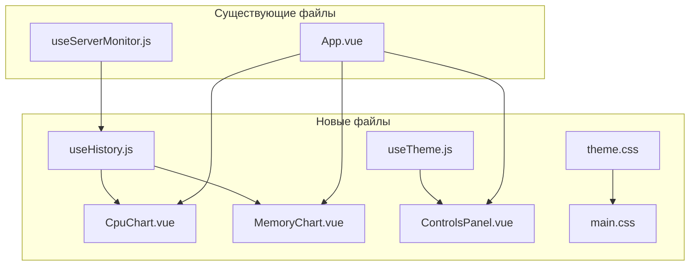

# План: Графики истории CPU/RAM и тёмная тема

## Обзор

Добавление двух новых функций в Vue-приложение мониторинга сервера:
1. **Графики истории** — визуализация загрузки CPU и RAM за последние 30 минут
2. **Тёмная тема** — переключение между светлой и тёмной темой

---

## Архитектура



---

## Часть 1: Графики истории CPU/RAM

### 1.1 Установка зависимостей

```bash
npm install chart.js vue-chartjs
```

### 1.2 Composable: useServerHistory.js

**Файл:** `vue-app/src/composables/useServerHistory.js`

**Назначение:** Хранение истории показателей в памяти (максимум 60 точек = 30 минут при обновлении каждые 30 сек)

**Функции:**
- `addDataPoint(serverData)` — добавление новой точки данных
- `cpuHistory` — reactive массив истории CPU
- `memoryHistory` — reactive массив истории RAM
- `timestamps` — массив временных меток
- `clearHistory()` — очистка истории

**Структура данных:**
```javascript
{
  timestamps: ['14:00', '14:01', '14:02', ...],
  cpu: {
    load_1min: [0.5, 0.7, 0.6, ...],
    load_5min: [0.4, 0.5, 0.5, ...],
    load_15min: [0.3, 0.4, 0.4, ...]
  },
  memory: {
    used_percent: [45, 47, 46, ...]
  },
  traffic: {
    in: [125.5, 130.2, 128.7, ...],  // KB/s
    out: [45.1, 48.3, 46.8, ...]     // KB/s
  }
}
```

### 1.3 Компонент: CpuChart.vue

**Файл:** `vue-app/src/components/CpuChart.vue`

**Props:**
- `historyData` — объект с историей CPU

**Реализация:**
- Line chart с 3 линиями (1min, 5min, 15min load)
- Цвета: синий, зелёный, оранжевый
- Анимация отключена для плавности
- Адаптивный размер

### 1.4 Компонент: MemoryChart.vue

**Файл:** `vue-app/src/components/MemoryChart.vue`

**Props:**
- `historyData` — объект с историей памяти

**Реализация:**
- Area chart с градиентом
- Цвет: фиолетовый
- Пороговые линии (50%, 80%)

### 1.5 Компонент: TrafficChart.vue

**Файл:** `vue-app/src/components/TrafficChart.vue`

**Props:**
- `historyData` — объект с историей трафика

**Реализация:**
- Dual line chart (входящий/исходящий трафик)
- Цвета: зелёный (in), синий (out)
- Ось Y в KB/s
- Заполнение области под линиями

### 1.6 Интеграция

**Изменения в useServerMonitor.js:**
- Импортировать `useServerHistory`
- Вызывать `addDataPoint()` после успешного получения данных

**Изменения в App.vue:**
- Добавить компоненты графиков под соответствующие карточки
- Передавать данные истории через props

---

## Часть 2: Тёмная тема

### 2.1 CSS переменные

**Файл:** `vue-app/src/styles/theme.css`

```css
:root {
  --bg-primary: #667eea;
  --bg-secondary: #764ba2;
  --card-bg: #ffffff;
  --text-primary: #333333;
  --text-secondary: #555555;
  --border-color: #eeeeee;
  --accent-color: #667eea;
}

[data-theme=dark] {
  --bg-primary: #1a1a2e;
  --bg-secondary: #16213e;
  --card-bg: #0f3460;
  --text-primary: #e0e0e0;
  --text-secondary: #b0b0b0;
  --border-color: #2a2a4a;
  --accent-color: #667eea;
}
```

### 2.2 Composable: useTheme.js

**Файл:** `vue-app/src/composables/useTheme.js`

**Функции:**
- `isDark` — reactive boolean
- `toggleTheme()` — переключение темы
- `initTheme()` — инициализация из localStorage

### 2.3 Компонент: ThemeToggle.vue

**Файл:** `vue-app/src/components/ThemeToggle.vue`

**Реализация:**
- Кнопка с иконкой 🌙/☀️
- Эмитит событие `toggle`

### 2.4 Интеграция

**Изменения в ControlsPanel.vue:**
- Добавить компонент ThemeToggle

**Изменения в main.js:**
- Инициализировать тему при старте приложения

**Изменения в main.css:**
- Заменить хардкод цвета на CSS переменные

---

## Структура файлов после изменений

```
vue-app/src/
├── components/
│   ├── CpuChart.vue          # НОВЫЙ
│   ├── MemoryChart.vue       # НОВЫЙ
│   ├── TrafficChart.vue      # НОВЫЙ
│   ├── ThemeToggle.vue       # НОВЫЙ
│   ├── ControlsPanel.vue     # ИЗМЕНЁН
│   └── ... (остальные)
├── composables/
│   ├── useServerHistory.js   # НОВЫЙ
│   ├── useTheme.js           # НОВЫЙ
│   └── useServerMonitor.js   # ИЗМЕНЁН
├── styles/
│   ├── theme.css             # НОВЫЙ
│   └── main.css              # ИЗМЕНЁН
├── App.vue                   # ИЗМЕНЁН
└── main.js                   # ИЗМЕНЁН
```

---

## Порядок реализации

1. Установить Chart.js и vue-chartjs
2. Создать `useServerHistory.js`
3. Создать `CpuChart.vue`, `MemoryChart.vue` и `TrafficChart.vue`
4. Интегрировать графики в `App.vue` и `useServerMonitor.js`
5. Создать `theme.css` с CSS переменными
6. Создать `useTheme.js`
7. Создать `ThemeToggle.vue`
8. Обновить `main.css` для использования переменных
9. Интегрировать переключатель темы в `ControlsPanel.vue`
10. Инициализировать тему в `main.js`

---

## Скриншоты ожидаемого результата

### Графики
```
┌─────────────────────────────────┐
│ 💻 Нагрузка CPU                 │
├─────────────────────────────────┤
│ [Line Chart с 3 линиями]        │
│                                 │
│ ─── 1 min  ─── 5 min  ─── 15 min│
└─────────────────────────────────┘
```

### Тёмная тема
```
┌─────────────────────────────────┐
│ 🖥️ Мониторинг сервера    🌙    │
├─────────────────────────────────┤
│ Тёмный фон карточек             │
│ Светлый текст                   │
│ Сохранённые акценты             │
└─────────────────────────────────┘
```
